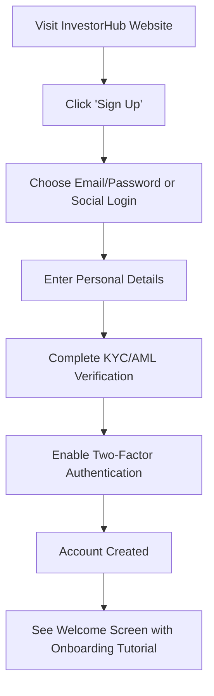
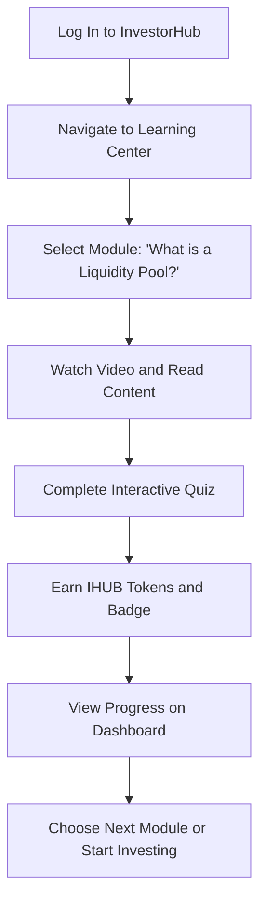
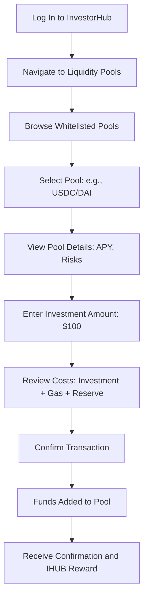
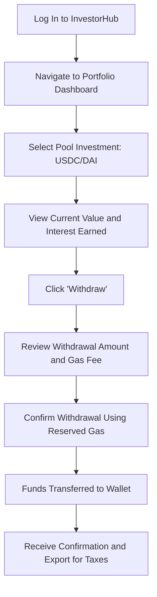
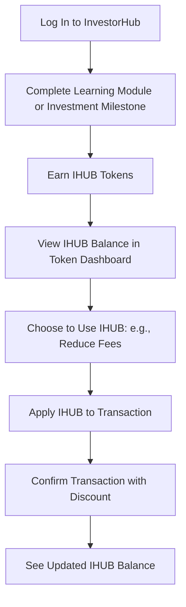

# Product Requirements Document (PRD): InvestorHub v1

## Web Application for Onboarding New Crypto Investors

### Document Information

**Document Status:** First revision  
**Last Updated:** June 28, 2025  
**Version:** 1.0

---

## 1. Executive Summary

### 1.1 Product Name

InvestorHub

### 1.2 Purpose and Vision

InvestorHub is a transformative web application designed to simplify cryptocurrency investing for beginners through DeFi liquidity pools. Our vision is to be the most trusted and intuitive platform for novice investors, offering a secure, engaging, and educational experience that builds confidence in navigating crypto. With a gamified learning journey, transparent cost management, automated gas fee solutions, and the IHUB token pegged to a stablecoin (USDC/DAI), InvestorHub acts as an Investment Integration Protocol, seamlessly connecting users to trusted DeFi opportunities while reducing cognitive barriers and common pitfalls.

### 1.3 Problem Statement

Newcomers to cryptocurrency face significant barriers: confusing terms, hidden gas fees, and complex DeFi concepts like liquidity pools and temporary losses from price changes. These create a high cognitive load, blocking beginners from earning interest in DeFi. InvestorHub solves this by simplifying investments with one-click access, offering interactive tutorials with IHUB token rewards, transparently managing fees, and curating secure liquidity pools.

### 1.4 Business Objectives

- **Grow to 100,000 active users** within 12 months of launch, tapping into the massive demand for accessible crypto investing.
- **Handle $250 million in transaction volume** in the first year, reflecting our focus on seamless liquidity pool investments.
- **Maintain 70% of users' activity after 6 months**, ensuring our platform remains engaging and easy to use.
- **Achieve an 80% completion rate among users**, empowering beginners with clear, gamified learning to build crypto confidence.
- **Earn $330,000 in revenue** through transaction fees, driven only by our user-friendly investment tool.
- **Total Addressable Market (TAM)**: $394.88 billion, the global fintech market size in 2025, covering all financial technology services.
- **Serviceable Addressable Market (SAM)**: $15 billion, targeting digital investment platforms and DeFi solutions for retail investors worldwide.
- **Serviceable Obtainable Market (SOM)**: $150 million, focusing on new crypto investors worldwide using our platform in the first year.

---

## 2. Target Audience

### 2.1 Detailed User Personas

#### Curious Beginner (Clara)

- **Demographics:** 25–40 years old, female, urban professional, earns $60,000–$100,000 annually, single or married without children, holds a bachelor’s degree.
- **Behaviors:** Spends 2–3 hours daily on her smartphone, primarily for social media (Instagram, LinkedIn) and news apps. She reads personal finance blogs and listens to podcasts like "The Money Guy Show" to manage her savings. She’s cautious with new technology but willing to try apps recommended by trusted sources. She has a basic brokerage account but has never invested in crypto due to perceived risks.
- **Needs:** Clear, jargon-free explanations of crypto concepts, a guided onboarding process to reduce intimidation, low-risk investment options to start, transparency on all fees, and educational resources to build confidence.
- **Motivations:** Wants to explore new financial trends, seeks better returns than her savings account (2–4% APY), and desires financial independence.
- **Pain Points:** Overwhelmed by crypto terminology (e.g., "gas fees", "impermanent loss"), fears losing money due to scams or volatility, unsure how to start investing, and concerned about hidden costs.

#### Traditional Investor (Tyson)

- **Demographics:** 35–55 years old, male, suburban family man, earns $100,000–$150,000 annually, married with two kids, has an MBA, works as a financial analyst.
- **Behaviors:** Spends 1–2 hours daily researching investments on platforms like Bloomberg and Yahoo Finance. He uses a traditional brokerage (e.g., Fidelity) to manage his portfolio of stocks and bonds. He attends financial seminars and reads books like "The Intelligent Investor." He’s methodical, prefers data-driven decisions, and is skeptical of new financial products until proven secure.
- **Needs:** High security and regulatory compliance, detailed risk and return data, transparent fee structures, comparisons to traditional assets, and tools for portfolio tracking.
- **Motivations:** Diversify his portfolio to hedge against inflation, capitalize on crypto’s high-yield potential (5–20% APY), and stay ahead of financial innovation to maintain his professional edge.
- **Pain Points:** Concerns about crypto platform security, hidden fees eroding returns, lack of regulatory clarity, and difficulty understanding DeFi concepts like liquidity pools compared to familiar assets.

#### Young Digital Native (Yuri)

- **Demographics:** 18–28 years old, non-binary, urban student or early-career professional, earns $30,000–$50,000 annually, single, pursuing or recently completed a degree in tech or design.
- **Behaviors:** Highly active online, spending 4–5 hours daily on platforms like TikTok, Discord, and Reddit (e.g., r/cryptocurrency). They follow crypto influencers on X, participate in NFT communities, and enjoy mobile games with reward systems. They have a small savings but are eager to invest small amounts ($50–$200) to learn and grow wealth.
- **Needs:** Gamified and engaging experiences, mobile-friendly design, ability to start with small investments, social elements (e.g., leaderboards), and clear benefits for using platform tokens.
- **Motivations:** Early adoption of tech trends, community engagement, learning through interactive experiences, and potential for quick financial growth despite limited capital.
- **Pain Points:** Limited funds to invest, overwhelmed by complex platforms, fears losing money due to inexperience, and seeks fun, low-pressure ways to learn about crypto.

#### Average Investment Size:

- Yuri (50%): $100.
- Clara (30%): $300.
- Tyson (20%): $5,000.

---

## 3. Goals and Objectives

### 3.1 Primary Goal

Facilitate the seamless entry of new investors into the crypto world via liquidity pool investments.

### 3.2 Key Objectives

- Enable users to earn interest by investing in liquidity pools.
- Simplify onboarding/offboarding with automated gas cost management.
- Use gamification to enhance customer learning and engagement.
- Reduce cognitive load through intuitive design and cost transparency.
- Introduce a native utility token (IHUB) pegged to a stablecoin (USDC or DAI).
- Query token data efficiently using TheGraph and a local cache.

---

## 4. User Stories / Use Cases

### 4.1 Account Creation and Onboarding

- **General Use Case:** As a new user, I want to create an account and complete onboarding easily to explore the platform.
- **Clara’s Interaction:** Clara hears about InvestorHub from a podcast and wants to try crypto investing. She needs a simple sign-up process with clear instructions, minimal technical jargon, and reassurance about security.
- **Tyson’s Interaction:** Tyson reads a review of InvestorHub in a financial newsletter and wants to diversify his portfolio. He expects a secure sign-up with KYC verification and detailed security information before proceeding.
- **Yuri’s Interaction:** Yuri discovers InvestorHub on Reddit and is excited to start with a small investment. They want a quick sign-up, possibly via social login, and immediate access to gamified learning to feel engaged.
- **User Flow Diagram (Mermaid):**

### 4.2 Learning About Crypto and Liquidity Pools

- **General Use Case:** As a user, I want to learn about crypto and liquidity pools through interactive modules to feel confident before investing.
- **Clara’s Interaction:** Clara starts with the "What is a Liquidity Pool?" module, appreciating the simple language, videos, and quizzes. She earns IHUB tokens for completing it, which builds her confidence to invest.
- **Tyson’s Interaction:** Tyson focuses on the "Understanding Impermanent Loss" module, valuing the detailed risk explanations and comparisons to traditional investments. He uses the glossary for unfamiliar terms.
- **Yuri’s Interaction:** Yuri dives into the gamified learning path, completing multiple modules to earn badges and IHUB tokens. They enjoy the interactive quizzes and track their progress on the leaderboard.
- **User Flow Diagram (Mermaid):**

### 4.3 Investing in a Liquidity Pool

- **General Use Case:** As a user, I want to invest a chosen amount into a liquidity pool to earn interest, with all costs clearly displayed.
- **Clara’s Interaction:** Clara selects a stablecoin pool (e.g., USDC/DAI) with a low-risk rating. She invests $100, reassured by the transparent gas fee breakdown and educational pop-ups explaining risks.
- **Tyson’s Interaction:** Tyson chooses a pool with a higher APY (e.g., ETH/USDC) after reviewing its risk score and historical performance. He invests $1,000, appreciating the clear fee structure and reserved gas for withdrawal.
- **Yuri’s Interaction:** Yuri starts with a small $50 investment in a beginner-friendly pool, excited to earn IHUB rewards for their first investment. They value the one-click process and gamified milestone achievement.
- **User Flow Diagram (Mermaid):**

### 4.4 Withdrawing from a Liquidity Pool

- **General Use Case:** As a user, I want to withdraw my investment and interest from a liquidity pool with a transparent process.
- **Clara’s Interaction:** Clara withdraws her $100 plus $5 interest after 3 months, using the reserved gas fee. She appreciates the guided process and real-time transaction status.
- **Tyson’s Interaction:** Tyson withdraws $1,200 (including interest) to rebalance his portfolio, ensuring the reserved gas covers the transaction. He exports the transaction for tax reporting.
- **Yuri’s Interaction:** Yuri withdraws their $55 (with interest) to celebrate a small win, enjoying the seamless process and earning a badge for their first withdrawal.
- **User Flow Diagram (Mermaid):**

### 4.5 Earning and Using IHUB Tokens

- **General Use Case:** As a user, I want to earn IHUB tokens through learning and investing, and use them for benefits within the platform.
- **Clara’s Interaction:** Clara earns IHUB by completing learning modules and uses them to reduce transaction fees on her next investment, feeling rewarded for her efforts.
- **Tyson’s Interaction:** Tyson earns IHUB through investing milestones and stakes them for additional benefits, appreciating their utility in enhancing his returns.
- **Yuri’s Interaction:** Yuri collects IHUB through gamified challenges and uses them to unlock premium learning content, enjoying the sense of achievement.
- **User Flow Diagram (Mermaid):**

---

## 5. Product Features and Requirements

### 5.1 User Account Management

- **Feature:** Secure user registration and profile management.
  - Registration via email/password or social logins.
  - Profile management for personal details and preferences.
  - Streamlined KYC/AML process with document scanning.
  - Two-Factor Authentication (2FA) with multiple options.
  - Session timeout controls and suspicious activity notifications.
- **Requirements:**
  - Integration with a third-party KYC/AML provider (e.g., Onfido).
  - Secure storage of personal information (GDPR/CCPA compliant).
  - Account recovery mechanisms.

### 5.2 User Onboarding & Education

#### 5.2.1 Gamified Learning Path

- **Priority:** Critical
- **Description:** A gamified educational experience introducing users to crypto basics, liquidity pools, and investing strategies.
- **Features:**
  - Multi-level curriculum (e.g., "What is a Liquidity Pool?", "Understanding Impermanent Loss").
  - Interactive tutorials (text, videos, infographics) with quizzes.
  - Achievement system: badges, levels, experience points (XP), and rewards (IHUB tokens).
  - Challenges (e.g., "Add $10 to a Liquidity Pool") to earn bonus IHUB.
  - Progress tracking dashboard with optional streaks and leaderboards.
- **Requirements:**
  - Adaptive content based on user knowledge level.
  - In-app notifications to prompt learning task completion.
  - Rewards integrated with IHUB token distribution.

#### 5.2.2 Contextual Explanations & Glossary

- **Priority:** High
- **Description:** In-app explanations of crypto terms and concepts.
- **Features:**
  - Hover/tap definitions for technical terms (e.g., "gas fees", "impermanent loss").
  - Comprehensive searchable glossary.
  - "Learn more" links to educational content.
  - Visual explainers for complex processes (e.g., liquidity pool mechanics).
- **Requirements:**
  - Context-sensitive help system.
  - Simplified terminology throughout the interface.

#### 5.2.3 Investment Simulator

- **Priority:** Medium
- **Description:** Practice environment for simulating crypto investments and liquidity pool participation with virtual currency.
- **Features:**
  - Virtual currency for practice trading and liquidity provision.
  - Real-time market data for realistic simulation.
  - Performance tracking and guided scenarios.
- **Requirements:**
  - Achievement rewards for successful simulations.
  - Integration with cached token data for market realism.

### 5.3 Investment Features

#### 5.3.1 Liquidity Pool Investments

- **Priority:** Critical
- **Description:** Enable users to invest in liquidity pools and earn interest.
- **Features:**
  - Curated list of whitelisted liquidity pools (e.g., ETH/USDC, DAI/USDT) from reputable DEXs (e.g., Uniswap, AAVE).
  - Display potential interest rates (APY), risks (e.g., impermanent loss), pool details (underlying tokens, TVL), and simplified risk scores.
  - One-click investment options for adding funds to pools.
  - Real-time tracking of interest earned, pool performance, and yield analytics.
- **Requirements:**
  - Integration with decentralized exchanges and lending protocols for pool access.
  - Transparent display of risks and rewards with clear impermanent loss explanations.

#### 5.3.2 Simplified Onboarding & Offboarding Process

- **Priority:** Critical
- **Description:** A streamlined process for adding and withdrawing investments.
- **Features:**
  - Fiat-to-crypto onramps (e.g., via bank transfers, credit/debit cards).
  - Crypto deposit/withdrawal functionality for supported assets (e.g., USDC, DAI, ETH).
  - Automated gas fee calculation and reservation for future withdrawals.
  - Clear breakdown of all fees before transaction confirmation.
  - Guided withdrawal process with real-time transaction status tracking.
- **Requirements:**
  - Integration with fiat payment gateways (e.g., Stripe, MoonPay, Ramp).
  - Wallet integration (e.g., MetaMask, WalletConnect).
  - Batch processing for gas fee optimization.

#### 5.3.3 Gas Fee Management

- **Priority:** Critical
- **Description:** Transparent calculation and reservation of gas fees for onboarding/offboarding.
- **Features:**
  - Calculate gas cost for onboarding an investment.
  - Double the gas cost to reserve funds for future offboarding.
  - Display total cost (investment + gas + reserve) before confirmation.
  - Notify users if gas prices spike, offering to delay transactions.
- **Requirements:**
  - Use Ethereum gas price APIs (e.g., Etherscan Gas Tracker) for estimation.
  - Reserve gas funds in a separate escrow wallet or smart contract.
  - Gas price optimization strategies (e.g., batching).
  - Fee adjustment mechanisms for network congestion.

#### 5.3.4 InvestorHub Utility Token (IHUB)

- **Priority:** High
- **Description:** Native platform token pegged to a stablecoin (USDC or DAI).
- **Features:**
  - Pegged to USDC (1 IHUB = 0.10 USDC, adjustable based on stablecoin selection).
  - Used for in-app rewards, transaction fee discounts, premium features, staking, and future governance.
  - Rewards distributed for completing educational content and investment milestones.
  - Token dashboard showing holdings, rewards, and benefits.
- **Requirements:**
  - Smart contract to mint and manage IHUB on Ethereum.
  - Mechanism to maintain the peg (e.g., collateralization, treasury management).
  - Distribution through gamification, potential airdrops to early users, or direct purchase.

#### 5.3.5 Portfolio Management

- **Priority:** High
- **Description:** Tools to track and manage liquidity pool investments.
- **Features:**
  - Portfolio dashboard with visual charts of pool performance.
  - Breakdown of holdings, interest earned, risks (e.g., impermanent loss), and pre-paid withdrawal gas status.
  - Historical performance tracking, yield analytics, and profit/loss calculations.
  - Export functionality for tax reporting.
  - Custom watchlists and investment goal setting.
- **Requirements:**
  - Real-time price updates (maximum 15-second delay).
  - Integration with cached token data for performance metrics.

### 5.4 Technical Infrastructure

#### 5.4.1 TheGraph Integration

- **Priority:** Critical
- **Description:** Backend integration with TheGraph for token and pool data.
- **Features:**
  - Fetch data on whitelisted tokens and liquidity pools (e.g., price, volume, APY, TVL).
- **Requirements:**
  - TheGraph API integration with query optimization.
  - Failover mechanisms for API disruptions (e.g., CoinGecko, Space & Time as secondary sources).
  - Custom subgraph deployment for platform-specific data.

#### 5.4.2 Daemon Service & Caching System

- **Priority:** Critical
- **Description:** Background service to periodically query and cache token data.
- **Features:**
  - Daemon queries TheGraph every 5 minutes for updated token and pool data (prices, APYs, TVL).
  - Stores data in a local cache (e.g., Redis) for quick access.
  - Client subsystem uses the cache to reduce latency.
- **Requirements:**
  - Node.js daemon with Redis for caching.
  - Cache invalidation strategy and fallback to query TheGraph directly.
  - Monitoring and alerting for service health.

#### 5.4.3 Token Whitelist Management

- **Priority:** Critical
- **Description:** System for managing approved tokens and liquidity pools.
- **Features:**
  - Whitelist of supported tokens (e.g., ETH, USDC, DAI) and pools.
  - Display token/pool metadata (logos, descriptions, contract addresses).
- **Requirements:**
  - Admin interface for whitelist management.
  - Automated security and liquidity checks for tokens/pools.
  - Emergency blacklisting capability.

### 5.5 User Experience Features

#### 5.5.1 Cognitive Load Reduction

- **Priority:** Critical
- **Description:** Design principles to simplify the investing experience.
- **Features:**
  - Progressive disclosure of complex features.
  - Visual representation of blockchain concepts.
  - Step-by-step guided investment flows.
  - Educational pop-ups to explain terms (e.g., "impermanent loss").
- **Requirements:**
  - Simplified terminology and plain language explanations.
  - Default settings optimized for beginners with an advanced mode toggle.
  - Accessibility compliance (WCAG 2.1 AA).

#### 5.5.2 Responsive Web Design

- **Priority:** High
- **Description:** Optimal viewing across devices.
- **Requirements:**
  - Mobile-first responsive design for browsers (Chrome, Firefox, Safari, Edge).
  - Progressive Web App (PWA) capabilities for offline access.
  - Minimum screen resolution support: 320px width.

#### 5.5.3 Alerts & Notifications

- **Priority:** Medium
- **Description:** Customizable alerts to keep users informed.
- **Features:**
  - Price threshold alerts, yield rate changes, and portfolio updates.
  - Security alerts, educational content recommendations, and transaction status notifications.
- **Requirements:**
  - Web push and email notification support.
  - Notification preference management.

---

## 6. Technical Requirements

### 6.1 Frontend

- Built with React.js for a responsive user experience.
- Tailwind CSS for styling.
- Wallet integration via Wagmi or Ethers.js.

### 6.2 Backend

- Node.js with Express for the API server.
- Database: MongoDB for user data, Redis for caching token data.
- Daemon service to query TheGraph (GraphQL API).
- Smart contract for IHUB token management (Solidity, deployed on Avalanche).

### 6.3 Blockchain Integrations

- Ethereum mainnet for token transactions and IHUB management.
- TheGraph for querying token and liquidity pool data.
- Decentralized exchanges and lending protocols (e.g., Uniswap, AAVE) for liquidity pool integration.
- Gas price estimation via internal API.
- Price oracles for token valuation.

### 6.4 Security Requirements

- End-to-end encryption for communications.
- Secure wallet integration with user authentication.
- Initial Smart contract audits for IHUB and liquidity pool contracts.
- Majority of assets stored with multi-signature wallets.
- Withdrawn scheduled at regular intervals or a trigger is reached (Chainlink Automation).
- Rate limiting, DDoS protection, and anti-fraud systems.
- HTTPS with HSTS enforcement.
- Protection against common web vulnerabilities (XSS, CSRF, SQLi).

### 6.5 Performance Requirements

- Page load time under 2 seconds on broadband.
- API response times < 500ms for cached data.
- Cache refresh rate of token data (5 minutes).
- 99.9% uptime for core services.
- Support for 1,000 concurrent users.

---

## 7. Compliance & Regulatory Requirements

- Registration with financial authorities in operating jurisdictions.
- AML/CTF program implementation.
- GDPR/CCPA compliance for user data.
- Compliance with securities laws for token offerings and DeFi products.
- Transaction monitoring, suspicious activity reporting, and tax reporting capabilities.

---

## 8. Analytics & Success Metrics

- **Key Performance Indicators:**
  - Monthly active users (MAU), user acquisition cost (UAC), and average revenue per user (ARPU).
  - Total transaction volume, liquidity pool TVL, and average investment size.
  - User retention rates (7-day, 30-day, 90-day) Savi and time to first investment.
  - Educational module completion rates, gamification engagement, and IHUB token adoption.
  - Average user yield (APY) and Net Promoter Score (NPS)/CSAT.
- **Analytics Implementation:**
  - User behavior tracking, conversion funnel analysis, and feature usage monitoring.
  - A/B testing, heat mapping, and session recording for UX optimization.

---

## 9. Roadmap & Release Strategy

- **Phase MVP:** Core account functionality, security, basic educational modules, and liquidity pool integration for top 3 pools.
- **Phase Post-MVP:** Full gamification system, expanded whitelist using AI, investment simulator, portfolio analytics, and IHUB token launch.
- **Phase V1:** Advanced features (e.g., staking, additional DeFi options), mobile app, and social elements.

---

## 10. Gaps, Open Questions, and Risks

### 10.1 Gaps

- **Regulatory Compliance:** Limited detail on KYC/AML implementation and jurisdictional requirements.
- **Liquidity Pool Risks:** Incipient mechanism to mitigate impermanent loss for users.
- **User Education:** No assurance users fully understand liquidity pool risks.
- **Technical Implementation:** Detailed architecture for daemon service, caching strategy, and error handling for TheGraph outages not defined.
- **Revenue Model:** Specific fee structure (e.g., 0.1% of invested) is ony part of the income, other flows will be attached on V1.

### 10.2 Open Questions

- **Stablecoin Peg:** Should IHUB be pegged to USDC or DAI? What mechanism maintains the peg during depegging events?
- **Gas Fee Management:** How to handle insufficient reserved gas fees for offboarding due to price spikes? Should users top up or platform absorb differences?
- **TheGraph Reliability:** What if TheGraph experiences downtime? Should a secondary data source (e.g., CoinGecko, Space & Time) be integrated?
- **Liquidity Pool Selection:** What criteria for whitelisting pools? Who decides on inclusion/exclusion?
- **IHUB Utility:** What specific premium features will IHUB unlock? How to ensure long-term value?
- **Regulatory Landscape:** Which jurisdictions for initial launch, and how to adapt to evolving DeFi regulations?

### 10.3 Risks

- **Market Risks:** Crypto volatility, impermanent loss, and competitive landscape.
- **Technical Risks:** TheGraph disruptions, smart contract vulnerabilities, scalability challenges, and cache synchronization issues.
- **Operational Risks:** Gas fee fluctuations, liquidity constraints in pools, and customer support scaling.
- **Regulatory Risks:** Evolving regulations, potential token classification as a security, and DeFi product classification.
- **Business Risks:** High user acquisition costs, revenue shortfall, token adoption failure, and user retention challenges.

### 10.4 Risk Mitigation Strategies

- **Technical:** Redundancy for TheGraph, fallback data sources (e.g., CoinGecko, Space & Time), smart contract audits, and stress testing on V1.
- **Operational:** Dynamic fee adjustments, reserve fund for gas anomalies, and tiered support system.
- **Regulatory:** Legal reviews, phased rollout, and conservative token design.
- **Business:** Diversified revenue streams, strategic partnerships, and focus on user education.

---

## 11. Custody Model

- InvestorHub will operate as a **non-custodial** platform, utilizing wallet integrations (e.g., MetaMask, WalletConnect) for user-managed assets, ensuring users **always** maintain control of their funds.

---

## 12. Appendix

- **User Journey Maps:** Included as Mermaid diagrams in Section 4.
- **Wireframes & Mockups:** To be added.
- **Token Economics:** To be added.
- **Fee Structure Details:** To be added (tentative: 0.1% of invested amount).
- **Gamification System Design:** To be added.
- **Technical Architecture Diagrams:** To be added.
- **Compliance Framework:** To be added.
