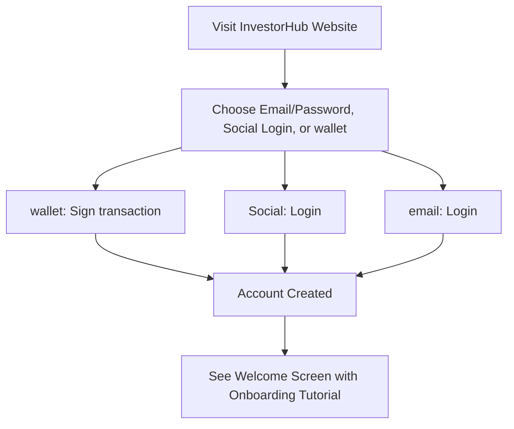
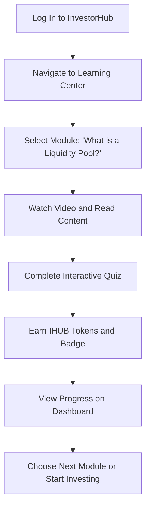
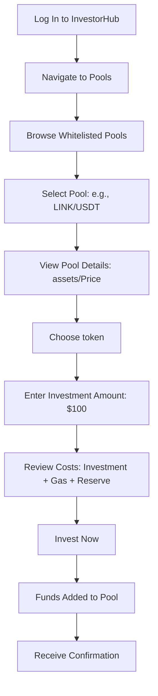
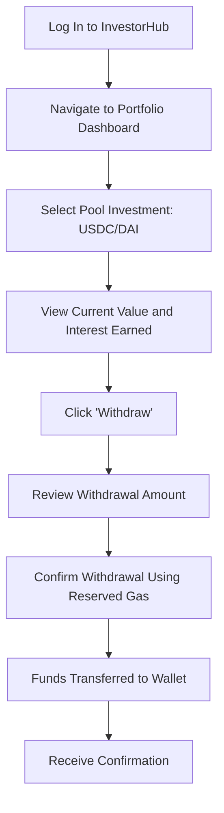
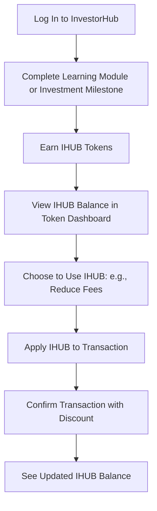

# 
 InvestorHub V1.0

---

  

---

## 
 Chainlink Chromion Hackathon 

 

### Links
- Pitch deck presentation is available on [YouTube](https://youtu.be/VlXMRe3jbEw)
- Live demo [website](https://investor-hub-rosy.vercel.app/)
- [Slide](https://github.com/77InnovationLabs/InvestorHub/blob/main/pitch/InvestorHub-The-Gamified-Gateway-to-DeFi-Investing.pdf) presentation

 

## 📚 Table of Contents

1. [Introduction](#1-introduction)
   - [1.1 What is *InvestorHub*?](#11-what-is-investorhub)
   - [1.2 Why is it relevant?](#12-why-is-it-relevant)
   - [1.3 How does *InvestorHub* work?](#13-how-does-investorhub-work)
   - [1.4 *InvestorHub* Advantages](#14-investorhub-advantages)
2. [InvestorHub Protocol](#2-investorhub-protocol)
   - [2.1 The MVP](#21-the-mvp)
3. [Tools Used](#3-tools-used)
   - [3.1 Chainlink Automation](#31-chainlink-automation)
   - [3.2 Chainlink CCIP](#32-chainlink-ccip)
   - [3.3 Chainlink CCT](#33-chainlink-cct)
   - [3.4 Data Feeds](#34-data-feeds)
   - [3.5 Chainlink Functions](#35-chainlink-functions)
   - [3.6 Chainlink Tools Summary Table](#36-chainlink-tools-summary-table)
4. [Flexibility and Security](#4-flexibility-and-security)
5. [User Stories / Use Cases](#5-user-stories--use-cases)
   - [5.1 Account Creation and Onboarding](#51-account-creation-and-onboarding)
   - [5.2 Learning About Crypto and Liquidity Pools](#52-learning-about-crypto-and-liquidity-pools)
   - [5.3 Investing in a Liquidity Pool](#53-investing-in-a-liquidity-pool)
   - [5.4 Withdrawing from a Liquidity Pool](#54-withdrawing-from-a-liquidity-pool)
   - [5.5 Earning and Using IHUB Tokens *(Post-MVP)*](#55-earning-and-using-ihub-tokens-post-mvp)

6. [Product Features and Requirements](#6-product-features-and-requirements)  
   - [6.1 User Account Management](#61-user-account-management)  
   - [6.2 User Onboarding & Education](#62-user-onboarding--education)  
     - [6.2.1 Gamified Learning Path](#621-gamified-learning-path)  
     - [6.2.2 Contextual Explanations & Glossary](#622-contextual-explanations--glossary)  
     - [6.2.3 Investment Simulator](#623-investment-simulator)  
   - [6.3 Investment Features](#63-investment-features)  
     - [6.3.1 Liquidity Pool Investments](#631-liquidity-pool-investments)  
     - [6.3.2 Simplified Onboarding & Offboarding Process](#632-simplified-onboarding--offboarding-process)  
     - [6.3.3 Gas Fee Management](#633-gas-fee-management)  
     - [6.3.4 InvestorHub Utility Token (IHUB)](#634-investorhub-utility-token-ihub--moved-to-post-mvp)  
     - [6.3.5 Portfolio Management](#635-portfolio-management)  
   - [6.4 Technical Infrastructure](#64-technical-infrastructure)  
     - [6.4.1 TheGraph Integration](#641-thegraph-integration)  
     - [6.4.2 Daemon Service & Caching System](#642-daemon-service--caching-system)  
     - [6.4.3 Token Whitelist Management](#643-token-whitelist-management)  
   - [6.5 User Experience Features](#65-user-experience-features)  
     - [6.5.1 Cognitive Load Reduction](#651-cognitive-load-reduction)  
     - [6.5.2 Responsive Web Design](#652-responsive-web-design)  
     - [6.5.3 Alerts & Notifications](#653-alerts--notifications)  

7. [Technical Requirements](#7-technical-requirements)  
   - [7.1 Frontend](#71-frontend)  
   - [7.2 Backend](#72-backend)  
   - [7.3 Blockchain Integrations](#73-blockchain-integrations)  
   - [7.4 Security Requirements](#74-security-requirements)  
   - [7.5 Performance Requirements](#75-performance-requirements)  

8. [Compliance & Regulatory Requirements](#8-compliance--regulatory-requirements)

9. [Analytics & Success Metrics](#9-analytics--success-metrics)

10. [Roadmap & Release Strategy](#10-roadmap--release-strategy)

11. [Gaps, Open Questions, and Risks](#11-gaps-open-questions-and-risks)  
    - [11.1 Gaps](#111-gaps)  
    - [11.2 Open Questions](#112-open-questions)  
    - [11.3 Risks](#113-risks)  
    - [11.4 Risk Mitigation Strategies](#114-risk-mitigation-strategies)  

12. [Custody Model](#12-custody-model)

13. [Our Thoughts](#13-our-thoughts)

14. [Conclusion](#14-conclusion)

15. [Developer Session](#15-developer-session)  
    - [15.1 Smart Contracts](#151-smart-contracts)  
      - [15.1.1 Diamond Structure](#1511-diamond-structure)  
      - [15.1.2 Diamond Business Logic - Swap Facets](#1512-diamond-business-logic---swap-facets)  
      - [15.1.3 Diamond Business Logic - Investment Facets](#1513-diamond-business-logic---investment-facets)  
      - [15.1.4 Diamond Business Logic - Chainlink Facets](#1514-diamond-business-logic---chainlink-facets)  
      - [15.1.5 Vault](#1515-vault)  
    - [15.2 Blockchains](#152-blockchains)  
    - [15.3 Tools](#153-tools)  
16. [On-chain Deployments & Interactions](#16-on-chain-deployments--interactions)
    - [16.1 On-chain Interactions](#161-on-chain-interactions)
    - [16.2 Deployments](#162-deployments)
17. [Team](#17-team)
18. [Appendix](#18-appendix)

    
 

---

 

## 1. Introduction

The DeFi ecosystem is not for everyone, yet. Newcomers to cryptocurrency face significant barriers: pishing, scams, confusing terms, hiding opportunities, complex operational and UI/UX that are not beginner friendly. These barriers create a high cognitive load, blocking beginners from earning interest in DeFi. InvestorHub solves this by simplifying investment processes to one-click access, through a unified interface that connects multiple battle-tested well-known protocols. Furthermore, offers interactive tutorials for newcomers with IHUB token rewards, transparent fee management, and curating secure investment opportunities. No matter the chain, no matter the token you have, we seamlessly connect users to opportunities.

 

### 1.1. What is _InvestorHub_?

InvestorHub is an abstraction layer designed to simplify on-chain investing through all ecosystem's opportunities. Our vision is to be the go-to and intuitive platform for novice investors, offering a secure, engaging, and educational experience that builds confidence, which includes pure DeFi and TradFi investments. With a gamified learning journey, transparent cost management, CCIP enabled cross-chain connections, and the IHUB utility token, the InvestorHub acts as an Investment Aggregator Protocol, seamlessly connecting users to secure DeFi opportunities while reducing cognitive barriers and common pitfalls.

 

### 1.2. Why is it relevant?

Recent estimations suggests that there are at least 1,000 active blockchains, and new projects are born every week. Although it seems too many, Sergey Nazarov(Chainlink Co-founder) often says that "each bank will have their own solution". Which means, looking from a TradFi perspective, there will be 10,000 plus blockchains eventually. Chainlink will connect them all, but how we expect users to track the opportunities that each, public, private, hybrid blockchains will offer? **They will not, and they don't need to because InvestorHub will aggregates the best of them in only one place**.

**Liquidity fragmentation** is real, but it's time to look into it as an **opportunity** and not as a problem. It is time to **connect** them all and stop complaining about it. But that's not enough, for this "experiment" to become the standard, is necessary to incentivize and to teach some core principles like keys management, investment risks and optimization opportunities, and that's why InvestorHub focus on the complete experience.

 

<h3> InvestorHub not only provides its users with the ways to do it, but will teach how to do it safely. </h3>

 

### 1.3. How does _InvestorHub_ works?

Leveraging Chainlink solutions, InvestorHub connects its users to investment opportunities in a simple and straightforward way. Following rigorous due diligence, InvestorHub offer curated investments to simplify users' access to wider variety of investment opportunities. Removing the complexity of accessing multiple interfaces, giving multiple approvals, or even bridging. Users not even need to posses the final asset they want to invest. InvestorHub accepts any dex-tradable token, bridge it, or only converts it into the final asset, and invest it in behalf of the user.

Multiple different steps, inherent risk to web3 interaction and costs are resumed to one single transaction triggering.

# TODO: Add Flow Charts

 

### 1.4. _InvestorHub_ Advantages

- Abstracts multi-step complexity to one single call;
- Connect users to investment in any CCIP enabled chain;
- UI/UX focused on non-native users;
- Educational website session to enable users to learn before taking risks.
- Powered by AI agents to quickly elucidate users doubts about each investment.

 

## 2. InvestorHub Protocol

### 2.1. The MVP

This MVP is based only on Uniswap integrations, which means that the swaps are performed through UniswapV3 and the investment options available are full-range UniswapV3 pools. It simulates the following scenarios:

- [x] The user has LINK, on **Avalanche**, and wants to invest in a LINK/USDC Uniswap pool:
   1. The user starts the transaction by providing the total amount of LINK he desires to invest;
   2. Half of the LINK is converted to USDC;
   3. The equal USD proportion of LINK and USDC is deposited into the pool;
   4. The user receives the NFT receipt.
- [x] The user has wETH, on **Avalanche**, and wants to invest in a LINK/USDC Uniswap Pool:
   1. The user starts the transaction by providing the total amount of wETH he desires to invest;
   2. Half of the wETH is converted to LINK;
   3. Half of the wETH is converted to USDC;
   4. The equal proportion of LINK and USDC is deposited into the pool.
- [x] The user has wBTC, on **Avalanche**, and wants to invest in a LINK/USDT Uniswap Pool on **Ethereum**:
   1. The user starts the transaction by providing the total amount of wBTC he desires to invest;
   2. The total amount of wBTC is converted into USDC;
   3. The USDC is bridged from **Avalanche** to **Ethereum**;
   4. Half of the USDC is swapped into LINK;
   5. Half of the USDC is swapped into USDT;
   6. The equal proportion of LINK and USDT is deposited into the pool on **Ethereum**.

 

### 2.2. Future Investment Available

A HUB for investors require a full range of options, attending all tastes and goals. The Uniswap options are a small part of what InvestorHub will provide for its users. Follows a complete list of options in our roadmap:

- **Yield**: Lending, Staking, Vaults, RWAs
- **Risk**: Options, Derivatives, Tranches
- **Liquidity**: LPing, AMMs, Bridge tokens
- **Speculation**: Indexes, Synthetic assets
- **Credit**: Tokenized debt, Peer lending, Bonds

## 3. Tools Used

### 3.1. Chainlink Automation - Chainlink’s hyper-reliable Automation network

The Chainlink Automation will automate IHUB token buybacks. To offer a simple and straightforward experience, the InvestorHub protocol will charge its fees on top of the token that will be invested. However, our token is a great part of our ecosystem, and the Chainlink Automation will be custom trigger based in a USD value threshold. Every time the total value of a fee token reach the threshold, the automation will be triggered to initiate a swap. Swapping whatever the fee token is, into IHUB tokens. The majority of tokens will enter a vesting period, while a small amount will be used to cost infra, periodical audits, bug bounties and the team.

 

### 3.2 Chainlink CCIP - Cross-Chain Interoperability Protocol

Chainlink CCIP is the backbone of our architecture. It connects our users to cross-chain investments in a secure and reliable manner. Investments and withdraws will be executed through CCIP lanes, when a user desires, removing trust assumptions and security concerns. This means that every cross-chain transaction, no matter if it is a user investment or a IHUB management, will be performed through CCIP's lanes.

 

### 3.3 Chainlink CCT

The Chainlink CCT is the pattern used on the InvestorHub Token(IHUB). It will enable seamless cross-chain transfers allowing the protocol to scale without constraints.

 

### 3.4 Data Feeds

Data Feeds enables us to convert CCIP fees, in LINK, into USDC and properly deduct the value from users before processing cross-chain transfers. It is a core feature for InvestorHub's complexity abstraction.

 

### 3.5 Chainlink Functions

Chainlink Functions is mainly being used to process IHUB swaps by creating the swap payload off-chain and excluding on-chain manipulation. It enable us to collect all information off-chain, creates the swap payload and trigger the swap. The Functions set will alway be triggered by the custom upkeep Automation keeper. The Chainlink Functions will also be used to trigger cross-chain transfers of protocol fees on chains the IHUB token has no liquidity, making possible to scale without liquidity dependency.

 

### 3.6 Chainlink Tools Summary Table

Select the solution link and get redirected to the code.

 

#### Chainlink CCIP
|    Contract    |   Line   |       Function         |   Go to  |
|----------------|----------|------------------------|----------|
|CCIPSendFacet   |   123    | _ccipsend.             | [Check](https://github.com/77InnovationLabs/InvestorHub/blob/07fad602654121354cf058f8fd5674f76a3a4d74/on-chain/src/facets/Chainlink/CCIPSendFacet.sol#L123-L193)|
|CCIPReceiverFacet|   86    | _ccipReceive           | [Check](https://github.com/77InnovationLabs/InvestorHub/blob/07fad602654121354cf058f8fd5674f76a3a4d74/on-chain/src/facets/Chainlink/CCIPReceiveFacet.sol#L86-L148)|

 

#### Chainlink Data Feeds
|    Contract    |   Line   | Function               |   Go to  |
|----------------|----------|------------------------|----------|
| DataFeedsFacet |    59    |   getUSDValueOfLink    | [Check](https://github.com/77InnovationLabs/InvestorHub/blob/07fad602654121354cf058f8fd5674f76a3a4d74/on-chain/src/facets/Chainlink/DataFeedsFacet.sol#L59-L73)|

 

#### Chainlink Functions
|    Contract    |   Line   |        Function        |   Go to  |
|----------------|----------|------------------------|----------|
|VaultAutomation |    59    |      performUpkeep     | [Check](https://github.com/77InnovationLabs/InvestorHub/blob/07fad602654121354cf058f8fd5674f76a3a4d74/on-chain/src/vault/VaultAutomation.sol#L123)|
| IHUBFunctions  |    68    |       sendRequest      | [Check](https://github.com/77InnovationLabs/InvestorHub/blob/07fad602654121354cf058f8fd5674f76a3a4d74/on-chain/src/vault/IHUBFunctions.sol#L68-L92)|

 

#### Chainlink Automation
|     Contract   |   Line   |        Function        |   Go to  |
|----------------|----------|------------------------|----------|
|VaultAutomation |    94    |      checkUpkeep       | [Check](https://github.com/77InnovationLabs/InvestorHub/blob/07fad602654121354cf058f8fd5674f76a3a4d74/on-chain/src/vault/VaultAutomation.sol#L94-L105)|
|VaultAutomation |   114    |     performUpkeep      | [Check](https://github.com/77InnovationLabs/InvestorHub/blob/07fad602654121354cf058f8fd5674f76a3a4d74/on-chain/src/vault/VaultAutomation.sol#L114-L124)

 

## 4. Flexibility and Security

InvestorHub architecture is designed to graciously connect different dots without having custody of money. By leveraging Chainlink solutions, with a modular architecture of a Diamond Proxy and the 'simplest complex flow', InvestorHub achieves the principles it is built for: Be a unified, non-web3-native friendly, and secure interface to power user interests.
The Diamond proxy enable the protocol to seamless add new investment options or update the ones available in isolation, without incurring the risk of compromising independent functionalities or core contracts.
Powered by 77 Innovation Labs pre-audit process, the InvestorHub next steps, once the protocol achieves complete code and documentation maturity, are:
- Private Audit with proven security companies such as Cyfrin, TrailOfBits, Guardian and SpearBit;
- Host a Competitive Audit on Cyfrin CodeHawks;
- Have a BugBounty with Immunefi.

 

## 5. User Stories / Use Cases

### 5.1 Account Creation and Onboarding

- **General Use Case:** As a new user, I want to create an account and complete onboarding easily to explore the platform.
- **Clara’s Interaction:** Clara hears about InvestorHub from a podcast and wants to try crypto investing. She needs a simple sign-up process with clear instructions, minimal technical jargon, and reassurance about security.
- **Tyson’s Interaction:** Tyson reads a review of InvestorHub in a financial newsletter and wants to diversify his portfolio. He expects a secure sign-up with KYC verification and detailed security information before proceeding.
- **Yuri’s Interaction:** Yuri discovers InvestorHub on Reddit and is excited to start with a small investment. They want a quick sign-up, possibly via social login, and immediate access to gamified learning to feel engaged.
- **User Flow Diagram (Mermaid):**

### 5.2 Learning About Crypto and Liquidity Pools

- **General Use Case:** As a user, I want to learn about crypto and liquidity pools through interactive modules to feel confident before investing.
- **Clara’s Interaction:** Clara starts with the "What is a Liquidity Pool?" module, appreciating the simple language, videos, and quizzes. She earns IHUB tokens for completing it, which builds her confidence to invest.
- **Tyson’s Interaction:** Tyson focuses on the "Understanding Impermanent Loss" module, valuing the detailed risk explanations and comparisons to traditional investments. He uses the glossary for unfamiliar terms.
- **Yuri’s Interaction:** Yuri dives into the gamified learning path, completing multiple modules to earn badges and IHUB tokens. They enjoy the interactive quizzes and track their progress on the leaderboard.
- **User Flow Diagram (Mermaid):**

### 5.3 Investing in a Liquidity Pool

- **General Use Case:** As a user, I want to invest a chosen amount of a token I hold into a liquidity pool to earn interest, with all costs clearly displayed.
- **Clara’s Interaction:** Clara selects a stablecoin pool (e.g., USDC/DAI) with a low-risk rating. She invests $100, reassured by the transparent gas fee breakdown and educational pop-ups explaining risks.
- **Tyson’s Interaction:** Tyson chooses a pool with a higher APY (e.g., ETH/USDC) after reviewing its risk score and historical performance. He invests $1,000, appreciating the clear fee structure and reserved gas for withdrawal.
- **Yuri’s Interaction:** Yuri starts with a small $50 investment in a beginner-friendly pool, excited to earn IHUB rewards for their first investment. They value the one-click process and gamified milestone achievement.
- **User Flow Diagram (Mermaid):**

### 5.4 Withdrawing from a Liquidity Pool

- **General Use Case:** As a user, I want to withdraw my investment and interest from a liquidity pool with a transparent process.
- **Clara’s Interaction:** Clara withdraws her $100 plus $5 interest after 3 months, using the reserved gas fee. She appreciates the guided process and real-time transaction status.
- **Tyson’s Interaction:** Tyson withdraws $1,200 (including interest) to rebalance his portfolio, ensuring the reserved gas covers the transaction. He exports the transaction for tax reporting.
- **Yuri’s Interaction:** Yuri withdraws their $55 (with interest) to celebrate a small win, enjoying the seamless process and earning a badge for their first withdrawal.
- **User Flow Diagram (Mermaid):**

### 5.5 Earning and Using IHUB Tokens

- **General Use Case:** As a user, I want to earn IHUB tokens through learning and investing, and use them for benefits within the platform.
- **Clara’s Interaction:** Clara earns IHUB by completing learning modules and uses them to reduce transaction fees on her next investment, feeling rewarded for her efforts.
- **Tyson’s Interaction:** Tyson earns IHUB through investing milestones and stakes them for additional benefits, appreciating their utility in enhancing his returns.
- **Yuri’s Interaction:** Yuri collects IHUB through gamified challenges and uses them to unlock premium learning content, enjoying the sense of achievement.
- **User Flow Diagram (Mermaid):**

---

## 6. Product Features and Requirements

### 6.1 User Account Management

- **Feature:** Secure user registration and profile management.
  - Registration via email/password or social logins.
  - Profile management for personal details and preferences.
  - Two-Factor Authentication (2FA) with multiple options.
  - Session timeout controls and suspicious activity notifications.
- **Requirements:**
  - Integration with a third-party KYC/AML provider (e.g., Onfido).
  - Secure storage of personal information (GDPR/CCPA compliant).
  - Account recovery mechanisms (Privy.io).

### 6.2 User Onboarding & Education

#### 6.2.1 Gamified Learning Path

- **Priority:** Medium
- **Description:** A gamified educational experience introducing users to crypto basics, investment options, and investing strategies.
- **Features:**
  - Multi-level curriculum (e.g., "What is a Liquidity Pool?", "Understanding Impermanent Loss").
  - Interactive tutorials (text, videos, infographics) with quizzes.
  - Achievement system: badges, levels, experience points (XP), and rewards (IHUB tokens).
  - Challenges/gamification (e.g., "Add $10 to a Liquidity Pool") to earn bonus IHUB.
  - Progress tracking dashboard with optional streaks and leaderboards.
- **Requirements:**
  - Adaptive content based on user knowledge level.
  - In-app notifications to prompt learning task completion.
  - Rewards integrated with IHUB token distribution.

#### 6.2.2 Contextual Explanations & Glossary

- **Priority:** High
- **Description:** In-app explanations of investment terms and concepts.
- **Features:**
  - Hover/tap definitions for technical terms (e.g., "gas fees", "impermanent loss").
  - Comprehensive searchable glossary.
  - "Learn more" links to educational content.
  - Visual explainers for complex processes (e.g., liquidity pool mechanics).
- **Requirements:**
  - Context-sensitive help system.
  - Simplified terminology throughout the interface.

#### 6.2.3 Investment Simulator

- **Priority:** Medium
- **Description:** Practice environment for simulating investments
- **Features:**
  - Simulated environment for practice.
  - Real-time market data for realistic simulation.
  - Performance tracking and guided scenarios.
- **Requirements:**
  - Achievement rewards for successful simulations.
  - Integration with cached token data for market realism.

### 6.3 Investment Features

#### 6.3.1 Liquidity Pool Investments

- **Priority:** Critical
- **Description:** Enable users to invest in liquidity pools and earn interest.
- **Features:**
  - Curated list of whitelisted liquidity pools (e.g., ETH/USDC, DAI/USDT) from reputable DEXs (e.g., Uniswap, AAVE).
  - Display potential interest rates (APY), risks (e.g., impermanent loss), pool details (underlying tokens, TVL), and simplified risk scores.
  - One-click investment options for adding funds to pools.
  - Real-time tracking of interest earned, pool performance, and yield analytics.
- **Requirements:**
  - Integration with decentralized exchanges and lending protocols for pool access.
  - Transparent display of risks and rewards with clear impermanent loss explanations.

#### 6.3.2 Simplified Onboarding & Offboarding Process

- **Priority:** Critical
- **Description:** A streamlined process for investing.
- **Features:**
  - On-chain deposit/withdrawal functionality for supported assets.
  - Automated gas fee calculation and reservation for future withdrawals.
  - Clear breakdown of all fees before transaction confirmation.
  - Guided withdrawal process with real-time transaction status tracking.
- **Requirements:**
  - Wallet integration (privy.io).
  - Batch processing for gas fee optimization.

#### 6.3.3 Gas Fee Management

- **Priority:** Critical
- **Description:** Transparent calculation and reservation of gas fees for onboarding/offboarding.
- **Features:**
  - Calculate gas cost for onboarding an investment.
  - Double the gas cost to reserve funds for future offboarding.
  - Display total cost (investment + gas + reserve) before confirmation.
  - Notify users if gas prices spike, offering to delay transactions.
- **Requirements:**
  - Use Avalanche gas price APIs for estimation.
  - Reserve gas funds in a separate escrow wallet or smart contract.
  - Gas price optimization strategies (e.g., batching).
  - Fee adjustment mechanisms for network congestion.

#### 6.3.4 InvestorHub Utility Token (IHUB) -> _moved to post-MVP_

- **Priority:** High
- **Description:** Native platform token.
- **Features:**
  - Used for in-app rewards, premium features, staking.
  - Distribution to reward users for completing educational content and investment milestones.
  - Token dashboard showing holdings, rewards, and benefits.
- **Requirements:**
  - Complete tokenomics development;

#### 6.3.5 Portfolio Management

- **Priority:** High
- **Description:** Tools to track and manage liquidity pool investments.
- **Features:**
  - Portfolio dashboard with visual charts of pool performance.
  - Breakdown of holdings, interest earned, risks, and pre-paid withdrawal gas status.
  - Historical performance tracking, yield analytics, and profit/loss calculations.
  - Export functionality for tax reporting.
  - Custom watchlists and investment goal setting.
- **Requirements:**
  - Real-time price updates.
  - Integration with cached token data for performance metrics.

### 6.4 Technical Infrastructure

#### 6.4.1 TheGraph Integration

- **Priority:** Critical
- **Description:** Backend integration with TheGraph for token and pool data.
- **Features:**
  - Fetch data on whitelisted tokens and liquidity pools.
- **Requirements:**
  - TheGraph API integration with query optimization.
  - Failover mechanisms for API disruptions.
  - Custom subgraph deployment for platform-specific data.

#### 6.4.2 Daemon Service & Caching System

- **Priority:** Critical
- **Description:** Background service to periodically query and cache token data.
- **Features:**
  - Daemon queries TheGraph every X period of time for updated data.
  - Stores data in a local cache for quick access.
  - Client subsystem uses the cache to reduce latency.
- **Requirements:**
  - Node.js daemon with Redis for caching.
  - Cache invalidation strategy and fallback to query TheGraph directly.
  - Monitoring and alerting for service health.

#### 6.4.3 Token Whitelist Management

- **Priority:** Critical
- **Description:** System for managing approved tokens and investment options.
- **Features:**
  - Whitelist of supported tokens and addition of new facets enabling new protocol integrations.
  - Display investment information.
- **Requirements:**
  - Admin interface for whitelist management.
  - Automated security and monitoring system to ensure compliance.

### 6.5 User Experience Features

#### 6.5.1 Cognitive Load Reduction

- **Priority:** Critical
- **Description:** Design principles to simplify the investing experience.
- **Features:**
  - Progressive disclosure of complex features.
  - Visual representation of blockchain concepts.
  - Step-by-step guided investment flows.
  - Educational pop-ups to explain terms.
- **Requirements:**
  - Simplified terminology and plain language explanations.
  - Default settings optimized for beginners with an advanced mode toggle.
  - Accessibility compliance.

#### 6.5.2 Responsive Web Design

- **Priority:** High
- **Description:** Optimal viewing across devices.
- **Requirements:**
  - Mobile-first responsive design for browsers.
  - Progressive Web App (PWA) capabilities for offline access.
  - Minimum screen resolution support: 320px width.

#### 6.5.3 Alerts & Notifications

- **Priority:** Medium
- **Description:** Customizable alerts to keep users informed.
- **Features:**
  - Price threshold alerts, yield rate changes, and portfolio updates.
  - Security alerts, educational content recommendations, and transaction status notifications.
- **Requirements:**
  - Web push and email notification support.
  - Notification preference management.

## 7. Technical Requirements

### 7.1 Frontend

- Built with React.js for a responsive user experience.
- Tailwind CSS for styling.
- Wallet integration via privy.

### 7.2 Backend

- Node.js with Express for the API server.
- Database: MongoDB for user data, Redis for caching token data.
- Daemon service to query TheGraph (GraphQL API).
- Smart contract for IHUB token management (Solidity, deployed on Avalanche).

### 7.3 Blockchain Integrations

- EVM compatible chains, and Solana, for investment initialization and IHUB CCT management.
- TheGraph for querying token and liquidity pool data.
- Decentralized exchanges for seamless asset conversion.
- Multiple investment options such as Aave, Compound, Euler, OndoFinance, Uniswap, etc.
- Chainlink solutions for secure connection and reliable data.
- Gas price estimation via internal API.
- Price oracles for token valuation.

### 7.4 Security Requirements

- No user asset custody.
- Multi Signature wallets(4/6) for protocol administrative roles.
- Circle Compliance System to block sanctioned users.
- Secure wallet integration with multi-factor user authentication.
- Rate limiting, DDoS protection, and anti-fraud systems.
- HTTPS with HSTS enforcement.
- Protection against common web vulnerabilities.
- Two consecutive audit processes, only after protocol maturity is achieved.
- On-chain Monitoring System
- Incident Response Plan
- Bug Bounty Program

### 7.5 Performance Requirements

- Page load time under 2 seconds on broadband.
- API response times < 500ms for cached data.
- Cache refresh rate of token data.
- 99.9% uptime for core services.
- Support for 1,000 concurrent users.

---

## 8. Compliance & Regulatory Requirements

- Registration with financial authorities in operating jurisdictions.
- AML/CTF program implementation.
- GDPR/CCPA compliance for user data.
- Compliance with securities laws for token offerings and DeFi products.
- Transaction monitoring, suspicious activity reporting, and tax reporting capabilities.

## 9. Analytics & Success Metrics

- **Key Performance Indicators:**
  - Monthly active users (MAU), user acquisition cost (UAC), and average revenue per user (ARPU).
  - Total transaction volume, liquidity pool TVL, and average investment size.
  - User retention rates (7-day, 30-day, 90-day) and time to first investment.
  - Educational module completion rates, gamification engagement, and IHUB token adoption.
  - Average user yield (APY) and Net Promoter Score (NPS)/CSAT.
- **Analytics Implementation:**
  - User behavior tracking, conversion funnel analysis, and feature usage monitoring.
  - A/B testing, heat mapping, and session recording for UX optimization.

## 10. Roadmap & Release Strategy

- **To be Released**

## 11. Gaps, Open Questions, and Risks

### 11.1 Gaps

- **Regulatory Compliance:** Limited detail on KYC/AML implementation and jurisdictional requirements.
- **Investment Risks:** Incipient mechanism to mitigate impermanent loss for users.
- **User Education:** No assurance users fully understand investment risks.
- **Technical Implementation:** Detailed architecture for daemon service, caching strategy, and error handling for TheGraph outages not defined.
- **Revenue Model:** Specific fee structure is only part of the income, other flows will be attached on V1.

### 11.2 Open Questions

- **Gas Fee Management:** How to handle insufficient reserved gas fees for offboarding due to price spikes?
- **TheGraph Reliability:** What if TheGraph experiences downtime? Should a secondary data source (e.g., CoinGecko, Space & Time) be integrated?
- **Investment Selection:** What criteria for whitelisting pools? Who decides on inclusion/exclusion?
- **IHUB Utility:** What specific premium features will IHUB unlock? How to ensure long-term value?
- **Regulatory Landscape:** Which jurisdictions for initial launch, and how to adapt to evolving DeFi regulations?

### 11.3 Risks

- **Market Risks:** Crypto volatility, impermanent loss, and competitive landscape.
- **Technical Risks:** TheGraph disruptions, smart contract vulnerabilities, scalability challenges, and cache synchronization issues.
- **Operational Risks:** Gas fee fluctuations, liquidity constraints, and customer support scaling.
- **Regulatory Risks:** Evolving regulations, potential token classification as a security, and DeFi product classification.
- **Business Risks:** High user acquisition costs, revenue shortfall, token adoption failure, and user retention challenges.

### 11.4 Risk Mitigation Strategies

- **Technical:** Redundancy for TheGraph, fallback data sources, smart contract audits, and stress testing on V1.
- **Operational:** Dynamic fee adjustments, reserve fund for gas anomalies, and tiered support system.
- **Regulatory:** Legal reviews, phased rollout, and conservative token design.
- **Business:** Diversified revenue streams, strategic partnerships, and focus on user education.

## 12. Custody Model

- InvestorHub will operate as a **non-custodial** platform, utilizing wallet integrations for user-managed assets, ensuring users **always** maintain control of their funds.

### 13. Our Thoughts

InvestorHub idea has born from SmartCon 2024 in Hong Kong. Following many panels, multiple different opinions, it became clear that the complete integration between TradFi and DeFi depends on great effort from both sides, but also, depends on tools that enable it.
Chainlink provides the infra, but there is lack of impact solutions focused on onboarding, on handling newcomers. That is what InvestorHub completely offers.

 

## 14. Conclusion

- TODO

 

## 15. Developer Session

### 15.1. Smart contracts

#### 15.1.1 Diamond Structure

- [Diamond](https://github.com/77InnovationLabs/InvestorHub/blob/main/on-chain/src/Diamond.sol);

- [DiamondCutFacet](https://github.com/77InnovationLabs/InvestorHub/blob/main/on-chain/src/diamond/DiamondCutFacet.sol);

- [DiamondLoupeFacet](https://github.com/77InnovationLabs/InvestorHub/blob/main/on-chain/src/diamond/DiamondLoupeFacet.sol);

- [OwnershipFacet](https://github.com/77InnovationLabs/InvestorHub/blob/main/on-chain/src/diamond/OwnershipFacet.sol);

- [DiamondInitializer](https://github.com/77InnovationLabs/InvestorHub/blob/main/on-chain/src/upgradeInitializers/DiamondInitializer.sol).

#### 15.1.2 Diamond Business Logic - Swap Facets

- [StartSwap](https://github.com/77InnovationLabs/InvestorHub/blob/main/on-chain/src/facets/dex/UniswapV3/StartSwapFacet.sol);

- [StartFullSwap](https://github.com/77InnovationLabs/InvestorHub/blob/main/on-chain/src/facets/dex/UniswapV3/StartFullSwapFacet.sol).

#### 15.1.3 Diamond Business Logic - Investment Facets

- [StartUniswapV3Position](https://github.com/77InnovationLabs/InvestorHub/blob/main/on-chain/src/facets/stake/UniswapV3/StartUniswapV3PositionFacet.sol);

- [DecreaseLiquidity](https://github.com/77InnovationLabs/InvestorHub/blob/main/on-chain/src/facets/stake/UniswapV3/DecreaseLiquidityFacet.sol);

- [Collect](https://github.com/77InnovationLabs/InvestorHub/blob/main/on-chain/src/facets/stake/UniswapV3/CollectFeesFacet.sol);

- [IncreaseLiquidity](https://github.com/77InnovationLabs/InvestorHub/blob/main/on-chain/src/facets/stake/UniswapV3/IncreaseLiquidityFacet.sol).

#### 15.1.4 Diamond Business Logic - Chainlink Facets

- [CCIPSend](https://github.com/77InnovationLabs/InvestorHub/blob/main/on-chain/src/facets/Chainlink/CCIPSendFacet.sol);

- [CCIPReceive](https://github.com/77InnovationLabs/InvestorHub/blob/main/on-chain/src/facets/Chainlink/CCIPReceiveFacet.sol);

- [DataFeeds](https://github.com/77InnovationLabs/InvestorHub/blob/main/on-chain/src/facets/Chainlink/DataFeedsFacet.sol).

#### 15.1.5 Vault

- [AutomatedVault](https://github.com/77InnovationLabs/InvestorHub/blob/main/on-chain/src/vault/VaultAutomation.sol).

 

### 15.2. Blockchains

- [Avalanche](https://www.avax.network)

- [Base Sepolia](https://www.base.org/)

- [Ethereum Sepolia](https://ethereum.org/pt-br/)

 

### 15.3. Tools

| Technology |    Type    |    Usage   |
|------------|------------|------------|
| [Chainlink Automation](https://docs.chain.link/chainlink-automation) |   Oracle   |    Automate Fees Conversion into InvestorHub Tokens       |
| [Chainlink CCIP](https://docs.chain.link/ccip)    |   Oracle   |    Enable Seamless and Secure Cross-chain Investment        |
| [Chainlink CCT](https://docs.chain.link/ccip/concepts/cross-chain-token)     |   Oracle   |    Standardize the Protocol's Token to Enable Cross-Chain Service Provision        |
| [Chainlink Data Feeds](https://docs.chain.link/data-feeds) |   Oracle   |    Enable LINK conversion into USD         |
| [Chainlink Functions](https://docs.chain.link/chainlink-functions)  |   Oracle   |    Monitor Protocol Status and Generate Swap Payloads for Fee's Token -> IHUB Token        |
| [Foundry](https://getfoundry.sh/)  | Framework  |    Development, Testing and Scripting        |
| [JavaScript](https://developer.mozilla.org/pt-BR/docs/Web/JavaScript) | P. Language|    Execute Chainlink Functions Off-chain Compute        |
|[Nestjs](https://nestjs.com/)  |   Framework         | Primary backend framework for building scalable and maintainable server-side applications |
|[Docker](https://www.docker.com/)  |   Container Platform        | Containerization solution for packaging and deploying applications consistently across environments |
|[MongoDB](https://www.mongodb.com/)  |   Database        | Primary database for storing application data |
|[Redis](https://redis.io/)  |   Cache     | In-memory caching layer for optimizing subgraph query performance |
|[Thegraph](https://thegraph.com/)  |   GraphQL API    | Decentralized indexing protocol for querying blockchain data about pools and tokens |
|[Heroku](https://www.heroku.com/)  |  Cloud Platform   | Cloud hosting platform for deploying and managing backend services |
|[Etherjs](https://docs.ethers.org/v6/)  |  Framework   | Framework to integrate with the blockchain |

 

## 16. On-chain Deployments & Interactions

### 16.1 On-chain Interactions

- [Opening Position](https://sepolia.etherscan.io/tx/0x20bed3167193c4d46611f2ac48ac7f9c26a465f73c319ef63f408bbfbbf3706b)

### 16.2 Deployments

| Contracts | Deploy Address |
|---|---|
| Diamond | 0xcB205dd75A20943905142c177d729Ec781d87dc8 |
| DiamondCut |  0xdA67F81659735834F8c00b5A3905884526294B17 |
| DiamondLoupe | 0x8D144Ce5D88238CfC634b4a4EbC9d4C13F3A71AD |
| Initializer | 0x95C7B28ABA475Ea7F201F87AcDD106611C8a4442 |
| Ownership | 0x3a314f6ec5be84fce01E0A244f612bdd8C7aE1Ef |
| Swap | 0x282b17587f1518BE4872477c3835d537D95Eb632 |
| fullSwap | 0xA6Cd62bd38186eA1c1F1a09Cef14B9db3b7431d6 |
| StartPosition | 0xba5749179f34170295830Ac5B33E66C0Db01dB71 |
| DecreasePosition | 0x25dF71F9aFF5880B3554ac9c9c78b9fAEF29E583 |
| CollectPosition | 0x2f93BA653Cd834B7a775eCE7Ea981CcfEBe963Fa |
| IncreasePosition | 0x2f93BA653Cd834B7a775eCE7Ea981CcfEBe963Fa |
| IncreasePosition | 0x2015F99b437b76A484D4ed7E3199655790C2B8dB |
| CCIPSend | 0x707a06f91751fdB8ee36C2804C57D9961a891Fa6 |
| CCIPReceive | 0xa1aEc0166Fa5E14571F2379E27e3D378E7FA0F5C |
| DataFeeds | 0xc3A348F867B1592d14CBDFb65F6169B0A53474fD |
| Vault | 0xacEa951B2E9b58Ce7914044Eaf41E2a4D04c7748 |

 

## 17. Team
| Name | Role | Socials |
|------|------|---------|
|Antonio Quental | Technical Project manager | [Visit](x.com/antonioquental)|
| Gabriel Thome | Full Stack Dev | [Visit](https://github.com/thomasdev5832) |
| Jether Rodrigues do Nascimento | Software Engineer - Arquiteto | [Visit](https://www.linkedin.com/in/jetherrodrigues/) |
| Lucas Archangelo | Gerente de TI | [Visit](https://www.linkedin.com/in/lucasrarchangelo?utm_source=share&utm_campaign=share_via&utm_content=profile&utm_medium=android_app) |
| Patrick "Barba" Carneiro | Blockchain Developer & Security Researcher | [Visit](https://linktr.ee/i3arba)|

 

## 18. Appendix

- **User Journey Maps:** Included as Mermaid diagrams in Section 4.
- **Wireframes & Mockups:** TBD
- **Token Economics:** TBD
- **Fee Structure Details:** TBD
- **Gamification System Design:** TBD
- **Technical Architecture Diagrams:** TBD
- **Compliance Framework:** TBD
